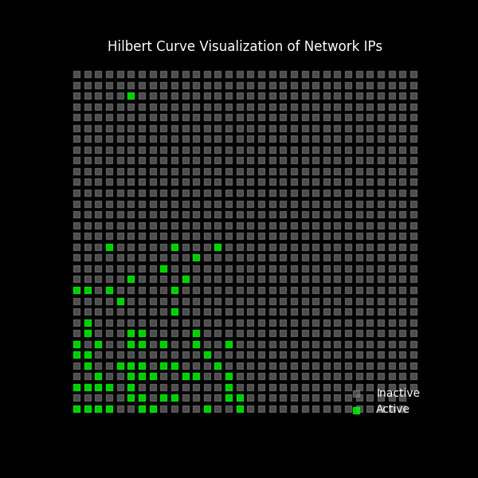
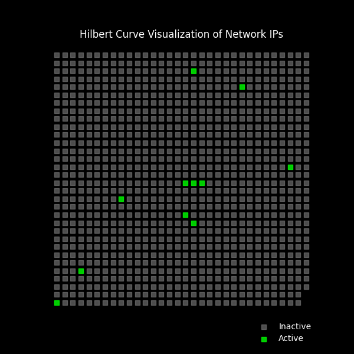

# Hilbert Curve from Network Ping

This Python program detects the user's network and subnet mask, then pings the derived IP range to determine active devices. The results are visualized using a Hilbert curve, which plots active and inactive IPs in a structured 2D representation. 

## Sample From My Home Networks

## Notes: 
- This program could likely be sped up greatly by adjusting the ping logic
- This won't always be 100% accurate based on device and network configurations to ignore ping requests
- This should NOT be done on any networks besides your own / network you have permission to ping scan on

##  Special Credit
This project was inspired by suckerpinch's YouTube video "Harder Drive: Hard drives we didn't want or need" Link: https://www.youtube.com/watch?v=JcJSW7Rprio

